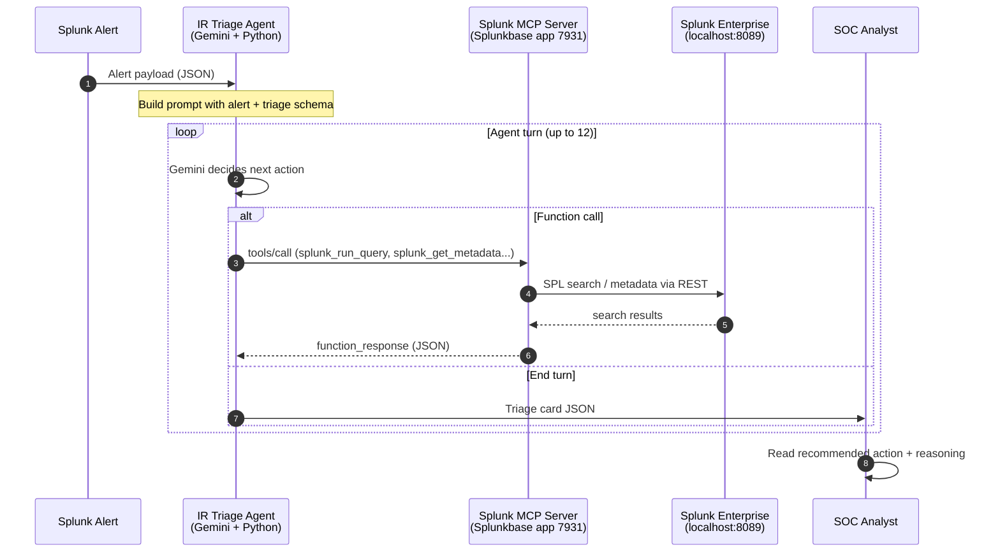

# Architecture

## Data flow



## Components

```mermaid
flowchart LR
    A[Alert Payload<br/>samples/*.json] --> B[__main__.py CLI]
    B --> C[agent.py<br/>Gemini function-call loop]
    C -->|tools/list, tools/call| D[splunk_mcp_client.py<br/>HTTP wrapper]
    D -->|Bearer token| E[/Splunk MCP Server/<br/>app 7931]
    E --> F[(Splunk Enterprise<br/>indexes)]
    C --> G[triage.py<br/>system prompt + schema]
    C --> H[Triage Card JSON<br/>classification, severity,<br/>action, reasoning, confidence]
```

## Why this is novel

Traditional SOAR systems run **static playbooks**: alert → predefined steps → action. They handle known patterns well but break on:

- Variants of known attacks the playbook didn't anticipate
- Multi-stage / context-dependent alerts where the right action depends on entity history
- Ambiguous alerts where "investigate vs suppress" is a judgment call, not a rule

Our agent puts a **semantic understanding layer** between alert and action. The LLM reads the alert in natural language, pulls context the way a human analyst would (related events, historical patterns, entity reputation), and emits a judgment with confidence — including explicit uncertainty flags when data is missing.

Output is **structured JSON** (not free text) so it slots into existing SOC workflows: feed the triage card to ServiceNow, PagerDuty, or any case management system. The recommended action is one of four discrete values (`escalate` / `contain` / `investigate` / `suppress`) so downstream automation stays trivial.

## Trust + safety

- All Splunk reads go through the MCP Server's RBAC (role `mcp_user`) — agent never has direct REST API access
- Splunk MCP Server's tools are read-mostly; no `delete_*`, no `disable_*` exposed
- Recommended actions are **suggestions only** — the agent emits a card, it does not execute containment
- Confidence + uncertainty flags surface ambiguity to the analyst instead of hiding it
